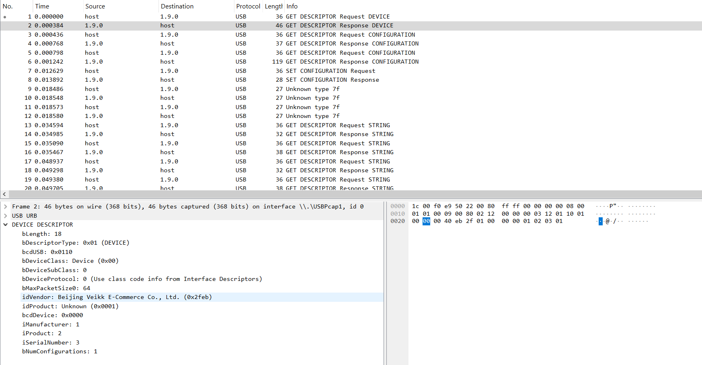
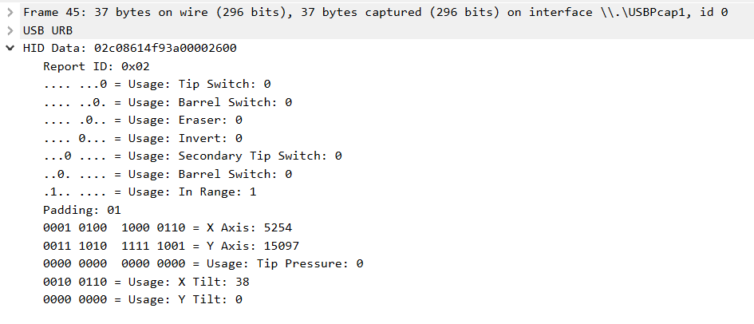

# How to Solve the Challenge?

In this challenge, a participant will be recieving a pcapng file. The pcapng is USB packets captured using wireshark for a graphical tablet. <br/>

The solution can be solution can be solved in several steps as shown below:

1. Loading the file into wireshark to observe the packets 
1. Locate the product information 
1. Search for vendor on google to understand device type 
1. Locate where the data could have started to be exchanged 
1. Identify data meaning; it shows pointer location and pressure applied 
1. Apply filters to see only required packets `usb.src == "1.9.2" && usb.transfer_type == 0x01` 
1. Write a script that will allow to regenerate the pointer locations and draw once there is pressure
    ```py
    if len(raw_data) >= 34:
        x_axis = int.from_bytes(raw_data[29:31], byteorder='little')
        y_axis = int.from_bytes(raw_data[31:33], byteorder='little')
        pressure = int.from_bytes(raw_data[33:35], byteorder='little')

        if pressure > 0:
            x_values.append(x_axis)
            y_values.append(y_axis)
    ```
1. Solution should be plotted 
1. Write flag as `ATHACKCTF{MY_NAM3_I5_J3FF}` 

# Automated Solution Procedure
1. Install dependencies using `pip install -r req.txt`
1. Add the pcapng from the artifacts folder to the solution (to be able to run the script or edit it to find file)
1. Run the script using `python3 ./redraw.py` to get the plot